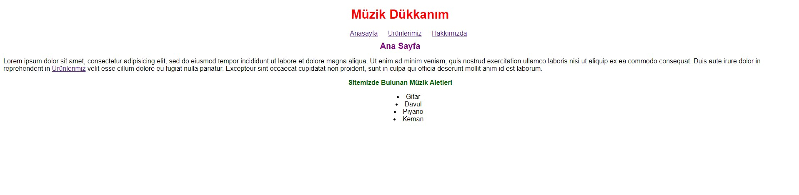
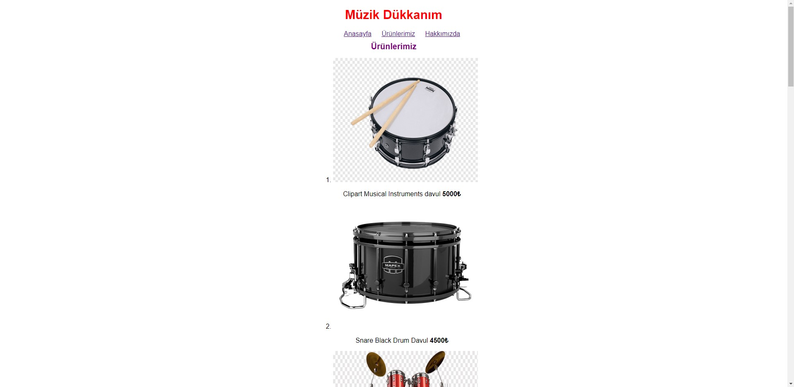
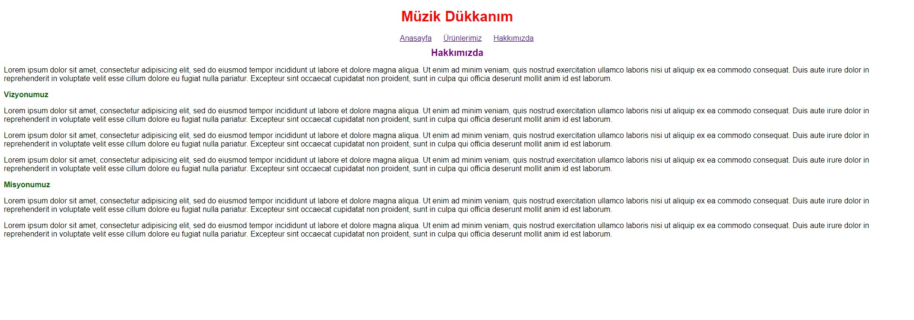
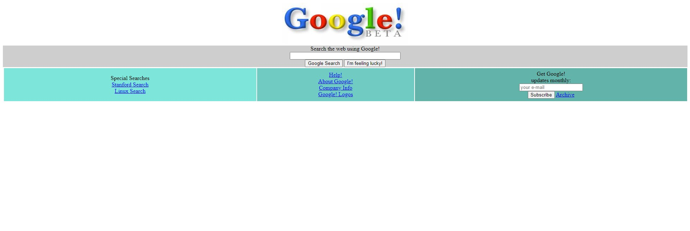
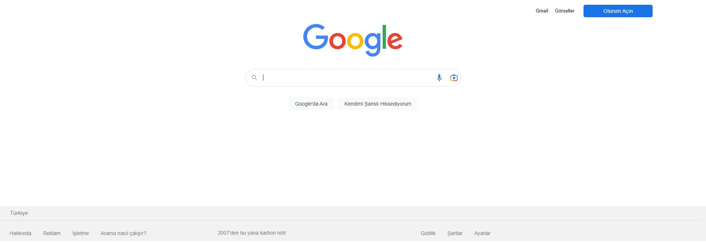

# CSS Eğitimi
[Patika.dev](https://www.patika.dev/tr) adresi üzerinden aldığım CSS Eğitimi içerisindeki ödevleri bu klasörde görebilirsiniz.

## Ödev-1

Herkese merhaba arkadaşlar kanalımıza hoş geldiniz, bugün HTML sayfamıza hafif bir makyaj yapacağız. Komik gelse de aslında tam olarak böyle yapacağız. Bir HTML sayfası oluşturup buna CSS ile tasarımsal açıdan güzellikler katacağız, HTML sayfamıza güzelliği getireceğiz.

* HTML sayfasını sıfırdan oluşturacaksınız. Eklemek istediğiniz ekstra özellikler tamamen size kalmış durumda.
* Sitemiz birkaç sayfadan oluşacak. Yani menü kısmında linkler vererek başka sayfaya geçilebilecek.
* Renkler tamamen sizin zevkinize kalmış durumda. Fakat renkler konusunda biraz yardım almak isterseniz Colorhunt renk paletleri konusunda muazzam bir site.
* Yazacağınız CSS etiketlerini Inline ve Internal yazabilirsiniz. External kullanmak tamamen sizin tercihinizdir.
* CSS yazarken noktalı virgülleri unutmayın. Biliyorum unutacaksınız, olur böyle şeyler...
* CSS ile ilgili yardımcı kaynak için w3schools.com'un CSS tutorialını, Türkçe kaynak için Fatih Hayrioğlu'nun web sitesini kullanabilirsiniz.
* Kendini tekrar eden yapılar kullanmamaya özen gösteriniz. Ya da kendini tekrar eden yapılarda kullandığımız özelliği kullanın. (İpucu: Inline(Etikete Özel), Internal(Aynı Dosyada) ve External(CSS Dosyasında) CSS Kullanımı)
* Sayfalarınızda kullandığınız fontlar için daha önce de videolarda bahsettiğimiz Google Fonts'u kullanabilirsiniz.
* Ana sayfada bulunan listelerin noktalarını ortalamak için list-style-position: inside'i kullanabilirsiniz.

Bu ödevde sizlerden istediğimiz hayal gücünüzü kullanarak öğrendiğiniz ve araştırarak bulduklarınızla birlikte güzel bir site oluşturmanız. Burada oluşturduğumuz sitenin tasarımı hoşunuza gitmese dahi burada önemli olan nokta CSS elemanlarını efektif bir şekilde kullanabiliyor muyuz onu görmek. Tasarımı ilerleyen ödevlerde daha güzelleştireceğiz.

## Ödev-2
Hepimiz her gün Google kullanıyoruz ve çok işimize yarıyor değil mi? Her gün Google'da milyonlarca arama yapılıyor ve hatta siz de bu sayfaya gelmek için Google'ı kullanmış olabilirsiniz. Peki Google'ın geçmişten günümüze nasıl geliştiğini hiç merak ettiniz mi?

Google 1996 yılında kuruldu ve ilk versiyonunu 1998 yılında yayınladı. 1998, çok uzun bir süre önce değil mi? İlk versiyonu ile şu anki versiyonu arasında büyük fark var tabii ki. Peki size Google'ın ilk versiyonunu gösterebileceğimizi söylesek ne hissederdiniz?

* Bu sayfada şu ana kadar öğrendiğiniz her şeyi kullanabilirsiniz. Bu sizin HTML becerilerinizi oldukça iyi bir şekilde geliştirmenizi sağlayacaktır.
* Butonların çalışmaması hiç sorun değil. Sadece tasarımsal olarak bu görüntüye benzesin ve aşağıdaki linkler çalışıyor olsun yeterli.
* Tasarladığınız bölümler ile alakalı kodunuzda açıklama satırlarına yer veriniz.
* Sayfa ile alakalı detaylara sayfanın üzerine sağ tıklayıp "İncele/Inspect" diyerek ulaşabilirsiniz.

## Ödev-3
* Bu ödevi yapabilmeniz için bolca "İncele/Inspect"'ten yararlanmanız gerekecektir. Sayfadayken sayfaya sağ tıklayıp "İncele/Inspect" demeniz yeterlidir.

* Fark ettiyseniz logo eski bir Google logosu. Bu logoyu günümüzde logo ile değiştirmelisiniz. Kullanmanız gereken logo assets klasöründe bulunmakta.

* Üstteki alanı sağ tarafa alın ve fotoğrafı kendi fotoğrafınız ile değiştirin ve fotoğrafın kenarlarını yarıçap özelliği ile düzenleyiniz.

* Arama yapılacak alanın kenarlarını yarıçap özelliği ile düzenleyiniz.

* Arama simgesi gibi sesle arama simgesini de siz ekleyin. (Nasıl yapıldığını görmek için Google Ana Sayfa'dan İncele ile yazılanları inceleyiniz.)

* Arama alanında yazı yazılan yerin genişliği 480px olmalı ve kenarlığı olmamalı.

* Buttonları ortaya alıp üstünden ve sağından boşluklar veriniz. Button kenarları 1px kalın #f2f2f2 renginde olmalı. Yazı tipi Arial, yazı rengi #5f6368, yazı boyutu 14px olmalı. Button yüksekliği 36px olmalı.

* Buttonlara aynı arama alanında olduğu gibi gölge veriniz.

* Footerda arkaplan rengini #f2f2f2 yapınız ve liste noktalarını ortadan kaldırın. (Bir önceki ödevde söylediğimiz w3schools.com'un CSS tutorialını, Türkçe kaynak için Fatih Hayrioğlu'un sitesini kullanabilirsiniz.)

* CSS dosyasında kullanılan bütün elementleri araştırıp ne işe yaradıklarını öğrenin. Daha sonra bunları kullanabileceğiniz projelerinizde kullanmaya özen gösterin.

* Tasarımı mümkün olduğunca benzetmeniz gerekmekte. Buttonların, arama kısmının çalışmaması önemli değil.

* Kod yazarken yorum satırları kullanmaya özen gösteriniz.

